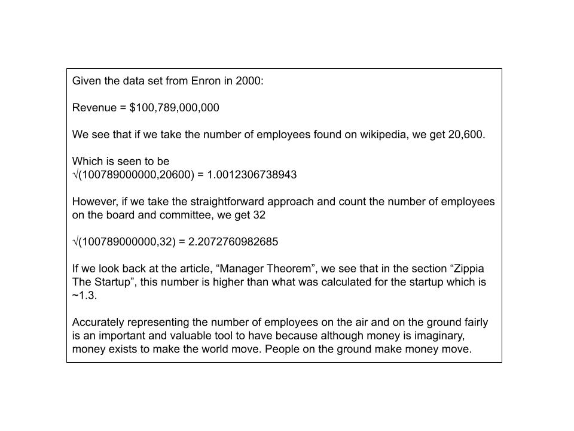

# The Case With Enron

### 1. Applying The Manager Theorem With Enron

-----

# References

Ung, E. (2024). Manager Theory. https://github.com/ericung/ManagerTheory

[Board Of Directors](https://enroncorp.com/corp/investors/annuals/2000/board)

[Committee](https://enroncorp.com/corp/investors/annuals/2000/committee)

[Enron](https://en.wikipedia.org/wiki/Enron)

*Notice that in the wikipedia page for the employee count, the reference is missing*

*The links from enroncorp could probably change, so I saved a copy it from when I viewed it.*

*Also, I saved a picture of the number of employees is when I looked at the wikipedia page, which could change.*
